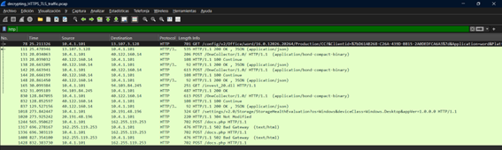
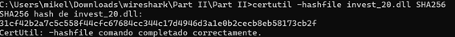
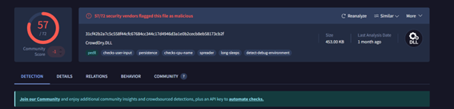

# Informe de Inteligencia de Amenazas (TI)

## 1. Resumen Ejecutivo
Durante el análisis de tráfico **HTTPS cifrado**, se identificó la descarga de un archivo malicioso oculto mediante **TLS**. Gracias a un archivo de registro de claves TLS, la captura **PCAP** fue descifrada con éxito en **Wireshark**, revelando la transacción HTTP que descargaba un fichero llamado **`invest_20.dll`**. Este binario representa una amenaza real, ya que su **hash SHA-256** coincide con un archivo previamente analizado en **VirusTotal** y detectado por múltiples motores antivirus. El incidente evidencia la necesidad de monitorizar y analizar tráfico cifrado, así como de contar con entornos seguros para examinar posibles malware.

## 2. Contexto del Incidente
La evidencia proviene de la captura **`decrypting_HTTPS_TLS_traffic.pcap`**, obtenida como parte de un laboratorio de seguridad. Debido a que la comunicación estaba cifrada mediante TLS, las transferencias HTTP originales quedaban ocultas. Para permitir su examen, se utilizó **`KeysLogFile.txt`**, que contiene las claves de sesión TLS necesarias. Tras configurar correctamente estas claves en **Wireshark**, el tráfico se descifró y se pudo identificar una solicitud HTTP que descargaba el archivo malicioso. El archivo fue extraído desde esa solicitud para su análisis estático.

## 3. Indicadores de Compromiso (IOC)
El archivo extraído se llama **`invest_20.dll`** y fue guardado en la ruta local de análisis. Su **hash SHA-256** es:

Este hash constituye el principal **IOC técnico** que permite identificar el binario de manera única. No se dispone de una URL pública de descarga, ya que la fuente provino directamente del tráfico HTTPS capturado y descifrado.

## 4. Análisis e Inteligencia de Amenazas (TI)
Al consultar el hash en **VirusTotal**, el archivo fue comparado con bases de datos de múltiples motores de detección. Los resultados indican que varias soluciones antivirus lo identifican como **malicioso**, confirmando que se trata de un binario con firma o comportamiento asociado a malware. Aunque los detalles exactos (familia, nombre asignado por cada motor) pueden variar según el vendor, la detección repetida sugiere que no se trata de un falso positivo aislado. La inclusión del archivo en VirusTotal indica que al menos un analizador lo ha catalogado como amenaza. Esto permite clasificar el archivo como de riesgo, con posibles capacidades de **ejecución arbitraria, persistencia y exfiltración de información**, dependiendo de su naturaleza interna.

## 5. Recomendaciones de Mitigación
Se recomienda:

- Bloquear de inmediato el **hash SHA-256** en todas las soluciones de seguridad (antivirus, EDR, listas negras de hashes) para prevenir su ejecución en cualquier equipo.
- Revisar los sistemas que pudieran haber recibido el archivo para detectar rastros de ejecución o comunicación con servidores externos.
- Reforzar el monitoreo del tráfico **HTTPS cifrado** con herramientas capaces de descifrado seguro en entornos controlados (máquinas virtuales) para detectar futuras amenazas similares.

